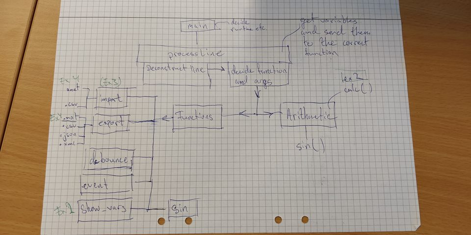

# Mini MATLAB - Technical report

## What we have learned

- How to create a proper software design and implement it
- How to use git and GitHub as tools for version management
- Better understanding of pointers
- Better understanding on how to do file I/O, with both binary and text

## Difficulties and solution

### Handling input

It is hard because of it is supposed to handle both inline arithemtic and commands.
Solution: Check each character and look for whitespace or '='-signs. Make a long list of if-statements, taking the arguments and formatting them for the proper function.

### Element-wise operations

To make it easy to implement new element-wise functions for vectors we created two functions; One to handle do operations on elements in a single vector and another to do operations between two vectors' elements.

```c
//Pass function as parameter to operate on single element
int vectorElOperation(matlab_arr_t* var, double (*func)(double), matlab_arr_t* result);

//Element-wise operation between two vectors
int vectorsElOperation(matlab_arr_t* var1, matlab_arr_t* var2, double (*func)(double, double), matlab_arr_t* result);

```

The usage of function pointers here is very effective, as we easily are able to implement any function that takes `double` as arguments and returns a `double`.

## Software design

The first software design was drawn on paper, with the main focus on the `processLine` function.


`processLine` turned out to be the most complex and long function, while most other functions were pretty straightforward.

## Possible improvements

- Handle matrices and n-sized arrays
- Better error handling in user input